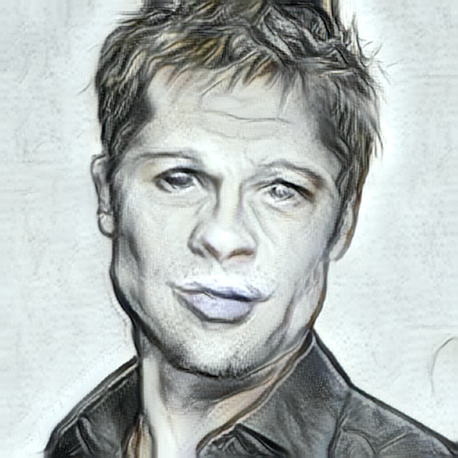
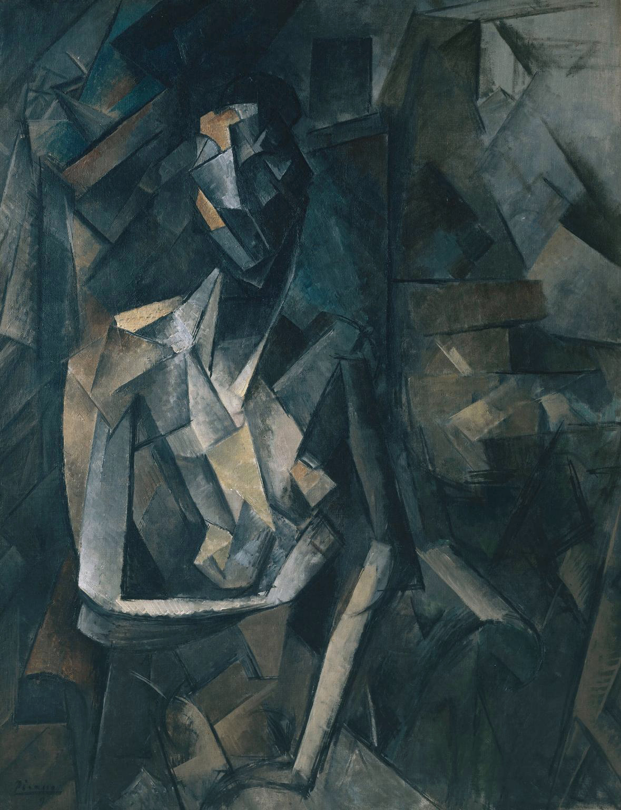
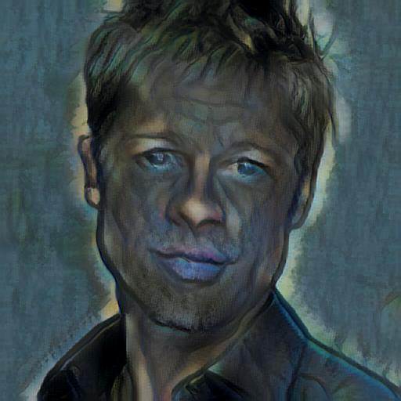

# StyleForge AI: Arbitrary Neural Style Transfer

Real-time arbitrary style transfer using **AdaIN (Adaptive Instance Normalization)**, built with PyTorch, with a Flask web app and a Gradio demo.

**🚀 Live Demo:** https://huggingface.co/spaces/Anisha0911/NST_Project

## Examples

<table align="center">
  <tr>
    <th align="center">Content</th>
    <th align="center">Style</th>
    <th align="center">Output</th>
  </tr>
  <tr>
    <td align="center" valign="middle"></td>
    <td align="center" valign="middle"></td>
    <td align="center" valign="middle"></td>
  </tr>
  <tr>
    <td align="center" valign="middle"></td>
    <td align="center" valign="middle"></td>
    <td align="center" valign="middle"></td>
  </tr>
</table>

## How it works

1. A VGG encoder extracts features from the content and style images.
2. AdaIN matches the mean and variance of the content features to the style features.
3. A decoder, trained from scratch, converts the result back into an image.
4. A style-strength slider (alpha, 0 to 1) blends between the original and the fully stylized output.

The decoder was trained for 20 epochs on about 40,000 content images and 8,600 style images.

## Tech stack

Python, PyTorch, Torchvision, Flask, Gradio, Bootstrap

## Project structure

- `app.py`: Flask web app (run locally)
- `app_gradio.py`: Gradio app (deployed on Hugging Face Spaces)
- `train.py`: decoder training script
- `utils/`: encoder, decoder and AdaIN code
- `templates/`: Flask HTML template
- `experiment/large_experiment/decoder_20.pth`: trained decoder
- `vgg_normalised.pth`: pretrained VGG encoder weights

## Run locally

```bash
git clone https://github.com/AnishaSinha01/NST_Project
cd NST_Project
pip install -r requirements.txt
python app.py
```

Open http://127.0.0.1:5050

## Train your own model

```bash
python train.py --content_dir <content_images> --style_dir <style_images> --epochs 20
```

## Reference

Huang and Belongie, *Arbitrary Style Transfer in Real-time with Adaptive Instance Normalization*, ICCV 2017. https://arxiv.org/abs/1703.06868
